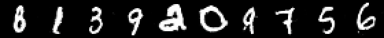

# generative_adversarial
* Various Generative Adversarial Networks using tensorflow
* Main Reference: https://github.com/shekkizh/EBGAN.tensorflow'
  * copied main optimizer code and most setup codes
  * refactored model build-up and variable-maintaing codes
  * modified some calculations to follow the details of the original paper

## EBGAN
* Generate face images based on CelebA data

## DCGAN
* Generate face images based on CelebA data

* Under epoch #1

||||

* Under epoch #2

||||

* Under epoch #3

||||

* Cherry-picked results

||||

## InfoGAN
* Generate  hand-written number images based on mnist data
* Need to fine-tune parameters
  * It is delicate to make InfoGan converge. It is easy to make simple GAN converge. But fine-tuning is needed when applying latent codes.
* Use simple adaptive generator optimization.
  * accuracy 0.4
* Use categorical latent code only (continuous latent code)
### Result

* After 14 epochs

* After 15 epochs

* comments
  * '8' to class #0, '1' to class #1, '3' to class #2, and so on.
  * '7', '9', '4' are not distinguishable in this result, this means that encoding of '7', '9', '4' into distinct codes failed.
    * But network can encode these 3 numbers into separate codes in another trial.
    * Whenever I try it, different result comes. Sometimes I succed all, sometime fail 2 numbers.

## Adversarial Autoencoders
